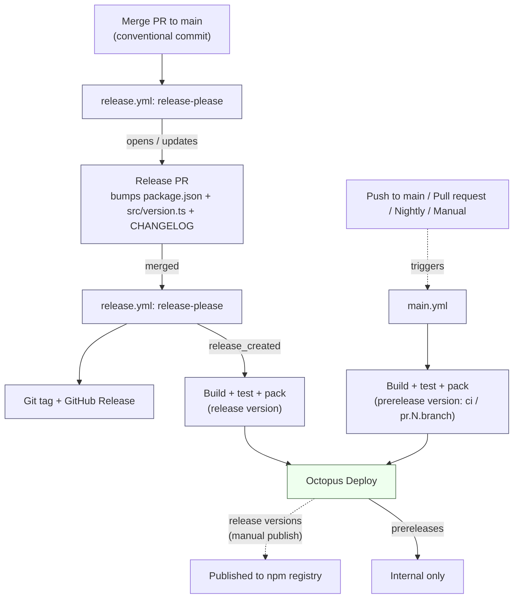

# Releasing

Versioning and publishing are automated. Release Please owns the version and changelog; GitHub Actions builds, tests, and packs the package; and Octopus Deploy publishes release versions to the npm registry.

## Pipeline

- **Release builds** run after a Release Please PR is merged; the packaged artifact is pushed to Octopus Deploy, from which the release version is published to the npm registry by a manual action.
- **Prerelease builds** run on pushes to `main`, the nightly schedule, and manual dispatches (all tagged `ci`), and PRs (`pr.<number>.<branch>`). These are pushed to Octopus Deploy and stay internal, except for fork PRs and Dependabot branches, which upload the package as a GitHub Actions artifact instead. Only `package.json` is stamped with the prerelease version; `src/version.ts` stays at the release base.

## Cutting a release

1. Merge changes to `main` using a [conventional commit message](https://www.conventionalcommits.org/).
2. Release Please opens or updates a **release PR** that bumps the version and updates the changelog.
3. Merge the release PR. The tag, GitHub release, build, and push to Octopus Deploy run automatically.
4. Promote the release to the npm registry manually from Octopus Deploy.
5. Confirm the artifact at [npmjs.com](https://www.npmjs.com/package/@octopusdeploy/openfeature).
